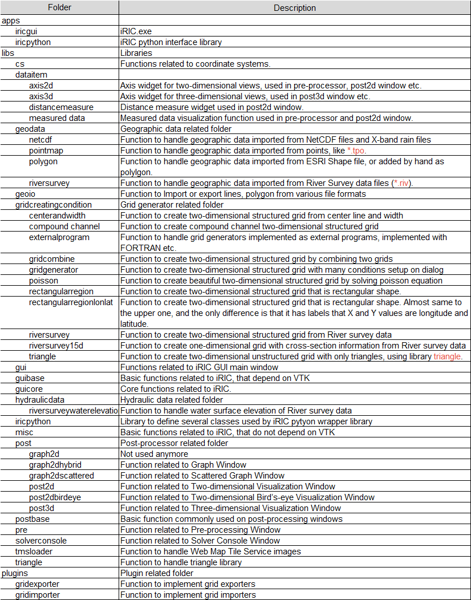

iRIC GUI source code abstract
==============================

This page describes very basic abstract of the iRIC GUI source code.

Programs and libraries used in iRIC GUI development
-----------------------------------------------------

iRIC depends on many programs and libraries. :numref:`table_iric_libraries` shows
the list of programs and libraries used in iRIC development.

.. list-table:: Programs and libraries used in iRIC development
   :name: table_iric_libraries

   * - Program / library 
     - Description

   * - Visual Studio 2013
     - C/C++ Compiler, Development IDE

   * - Qt 5.5
     - Cross-platform GUI Toolkit

   * - VTK 6.1
     - Visualization library (Countour, streamline etc)

   * - Qwt 6.1
     - Chart drawing library, built on Qt

   * - CGNS library 3.2
     - CGNS file I/O library

   * - Proj 4.8
     - Cartographic projections library (Longitude-latitude <-> X-Y)

   * - GDAL 1.11
     - Raster GIS Data I/O library

   * - GEOS 3.4
     - Geometry handling library

   * - Shapelib 1.3
     - ESRI Shape file I/O library

   * - iRIClib
     - Wrapper library for CGNS library

   * - HDF5 1.8
     - HDF5 file I/O library. CGNS files are now HDF5, so we need this.

   * - NetCDF 4.3
     - NetCDF file I/O library. iRIC can import NetCDF files now.

   * - yaml-cpp 0.5
     - YAML file I/O library

   * - FFMPEG
     - Movie encoder

   * - Zip / unzip
     - Program for zipping and unzipping ZIP files

   * - Qt Installer Framework 2.0
     - Tool to build iRIC offline installer and online update repository

The folders of iRIC GUI source code
-------------------------------------

The major folders that exist in iRIC GUI source code are described in :numref:`image_src_folders`.

.. _image_src_folders:

   Major folders of iRIC GUI source code

Important classes and methods
------------------------------

The major classes that are inherited by many subclasses are described in :numref:`table_iric_classes`.

.. list-table:: Major classes of iRIC GUI source code
   :name: table_iric_classes

   * - Class
     - Description

   * - ProjectDataItem
     - Abstract class that hold some data in the project

   * - GraphicsWindowDataItem
     - Subclass of ProjectDataItem. It corresponds to a node in the object browser.

   * - GraphicsWindowDataModel
     - Abstract class that is used as a main interface for data contained in a subwindow

   * - GraphicsWindowRootDataItem
     - Abstract class that is used as a root data container for a subwindow

   * - VTKGraphicsView
     - Abstract class to implement draw region with VTK rendering. Subclass of QVTKWidget.

   * - GeoData
     - Abstract class to implement geographic data.

   * - GeoDataMapper
     - Abstract class to implementing mapping geographic data onto grid nodes or cells.

   * - GridCreatingCondition
     - Abstract class to implement grid creating algorithm.

   * - SolverDefinitionNode
     - Abstract class to implement container for a node inside the solver definition file.

   * - Grid
     - Abstract class to store grid. Used in Pre-processor.

   * - PostDataContainer
     - Abstract class to implement a container for calculation result data in CGNS files.
