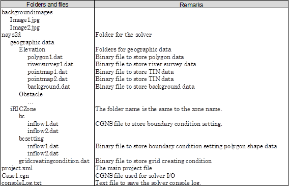
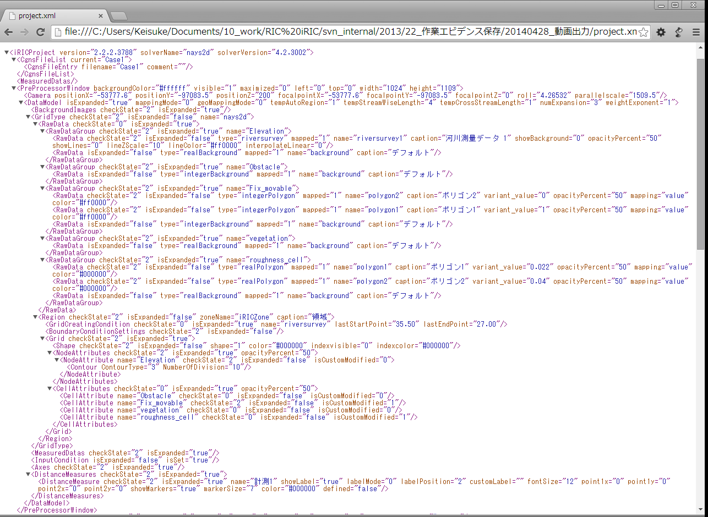
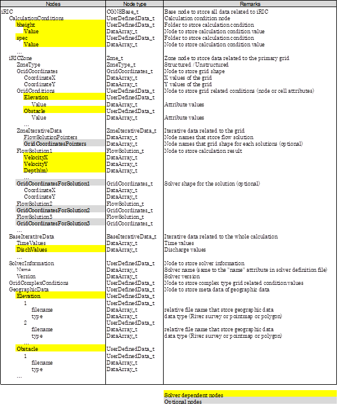

iRIC GUI File interfaces
==============================

Project file
-------------

Project file is a zip file, with extention ``*.ipro``. All data related to the project is
saved into the project file.

When a project is open, the content of the project file is unzipped into a subfolder in the following folder. The unzip target folder can be changed from iRIC GUI preference dialog.

``(User root folder)/.iRIC_workspace``

Project folder structure
~~~~~~~~~~~~~~~~~~~~~~~~~

The main folders and files within iRIC project folder are described in :numref:`image_proj_folders`.

.. _image_proj_folders:

   Main folders and files within iRIC project folder

The main project file structure
~~~~~~~~~~~~~~~~~~~~~~~~~~~~~~~~

The main project file ``project.xml`` is a XML file.

An example of a main project file is shown in :numref:`image_proj_mainfile`.

.. _image_proj_mainfile:

   Main project file structure example

The CGNS file structure
~~~~~~~~~~~~~~~~~~~~~~~~~

The CGNS file with the name ``Case1.cgn`` stores all information passed to
the solver.

The solve overwrites the CGNS file, to add calculation result.

:numref:`image_cgns_structure` show the structure inside the CGNS file.

.. _image_cgns_structure:

   CGNS file structure

