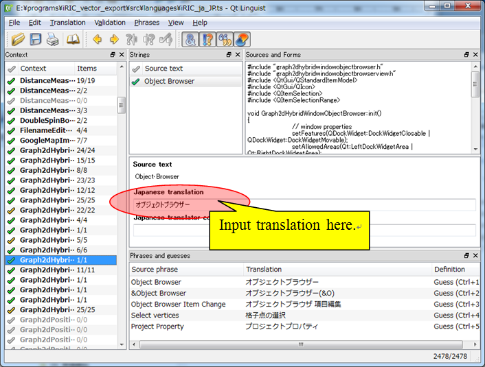

Internationalization
=====================

Overview
----------

iRIC GUI source codes are all written in English, but intended to be used worldwide,
so internationalization is important.

* When developing GUI dialogs, you'll have to care nothing. Qt automatically do the
  needed things for internationalization.

* When adding some sentences inside ``*.cpp`` files, that should be translated in other
  languages, use tr() to inform that the sentence should be translated, like the following

.. code-block:: c

   QMessageBox::warning(this, tr("Warning"), tr("File open error"));

Note that if you want to do the internationalization, that class should be a subclass
of QObject class, and has ``Q_OBJECT`` macro in the header file.

Preparing internationalization dictionary
------------------------------------------

When some new sentences to be translated are added, you have to prepare updated
internationalization dictionary, by the following procesure:

* Open Command prompt for Qt, go to the ``src`` folder, and input the following command.

.. code-block:: bat

   lupdate src.pro

This command will update ``languages/*.ts`` files.

* Launch Linguist (bundled with Qt), open the dictionary file, and edit the translated
  sentences.

.. _image_linguist:

   Linguist interface example

* Open Command prompt for Qt, go to the ``tools`` folder, and input the following command.

.. code-block:: bat

   python lrelease.py

Note that you need Python 3 installed to run this script.

How to add new language to support
-----------------------------------

When you want to add a new language to support, you can do it by adding a single line
in the project files ``*.pro``. Currently, the setting is as follows, for example:

.. code-block:: none

   TRANSLATIONS += \
     languages/iRIC_ja_JP.ts \
     languages/iRIC_ko_KR.ts \
     languages/iRIC_id_ID.ts \
     languages/iRIC_th_TH.ts \
     languages/iRIC_zh_CN.ts \
     languages/iRIC_vi_VN.ts \
     languages/iRIC_fr_FR.ts \
     languages/iRIC_es_ES.ts \
     languages/iRIC_ru_RU.ts

Please note that you have to add line to all the project files inside iRIC GUI repository.
